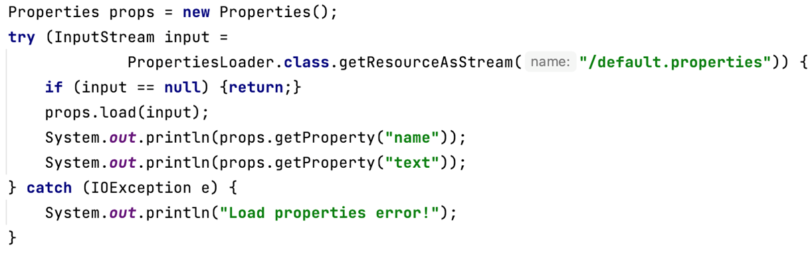
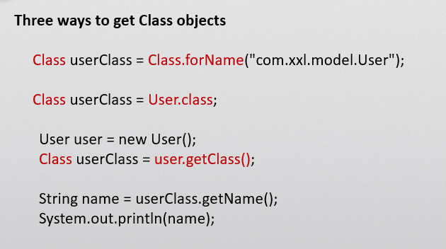
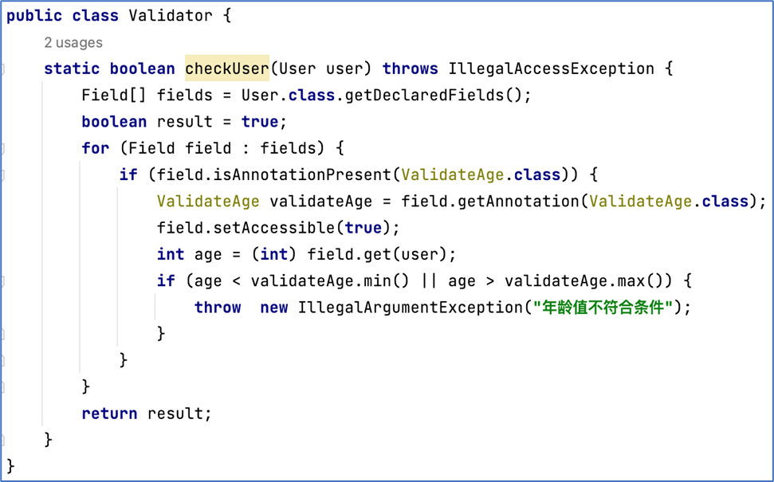
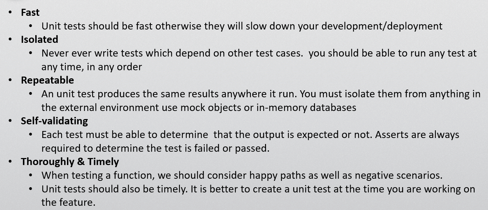

## 第二讲要点
---
#### 一、读写文件
一般可以用三种方式
1. input/output的字节流
2. Reader/Writer的字符流
3. Files工具类的使用
   
File，一般作为文件或文件夹对象，将字节流读入其中，可以使用其函数对其进行访问

**需要注意的是，在写代码时，一定要注意资源的释放，虽然java有自回收的功能，但是诸如文件，数据库连接等都属于为外部资源，必需要手动释放，例如在读完文件后，要写file.close()**

读取classpath下的文件

其中PropertiesLoader为当前函数所属于的类名，而getResourceAsStram为类加载器

***这里存疑，为什么用这样的类名，是否可以替换为其他的类***

#### 二、泛型

主要是为了类型安全
因为如果统一写为Object，容易进行非法输入，因此使用泛型，根据类型限定其参数和返回值等

#### 三、反射

*非常重要！！！*

可以通过三种方式对该类的class对象进行访问
1. 类的路径（在src里面的路径）
2. 该类本身
3. 该类创建的一个对象

**值得注意的是，class类，类本身，类的对象三者的相互转换**

获取到该类的class对象后，即可对其类的字段和成员变量进行访问和调用
同时我们也可以通过它来创建新的类的对象

#### 四、注解

注解理解为给编译器看的注释
通常需要一个interface的注解接口，一个类用来扫描注解和执行
注解的扫描本身也用到了反射的机制

通过输入的对象，获取到该对象的类的所有字段和方法
逐个扫描是否含有注解(isAnnotationPresent函数)
对含有该注解的方法或函数进行相应的操作

同时也可以在注解中设置一定的变量，在标记注解时，设定这个变量的值
在扫描到这个注解时，通过类来访问这个类所对应的注解对象，获取到设定的变量的值

#### 五、Maven

一个基本框架
Maven的配置文件 —— pom.xml
可以从中设置所用到的库，第一次运行时从中央仓库下载到本地，后面运行时，先在本地找没有再下载

#### 六、单元测试

*在平时写代码时也要写单元测试！！！*

使用注解 @Test 来写单元测试
使用断言ASSERT来进行判断（判定值，判定异常等等）
还可能用到的一些辅助注解
1、@BeforeAll @AfterAll
2、@BeforeEach @AfterAEach

